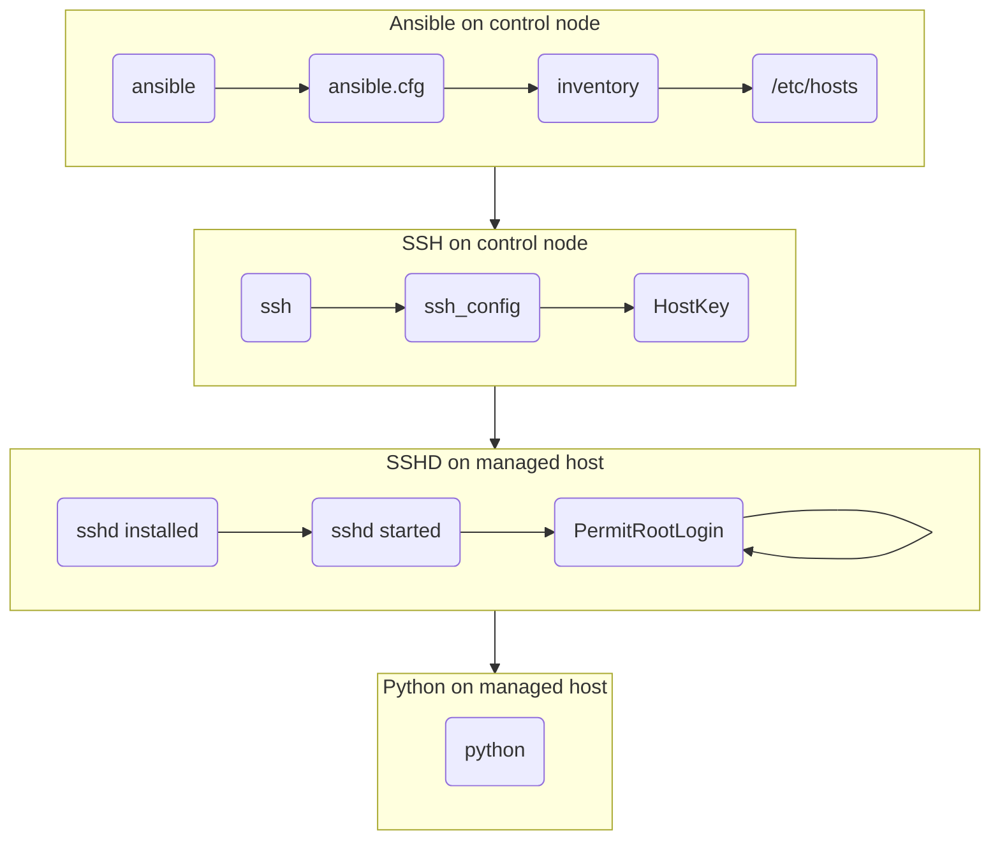

# Exercise 2. Troubleshooting Ansible Configuration

### In this exercise the following steps will be cerried out:

1. Participants are instructed to form group of pairs
2. One member shall introduce some failure to the Ansible configuration
3. Failures can affect any of the boxes on the Figure below
4. The other member shall try to localize and fix the failure introduced
5. The first member observes the process and helps with hints if neccessary
6. They test Ansible successfully access managed hosts together
7. Members of the pair swith roles and do the excercise again

## Figure 1. Validation process for Ansible configuration

## Validation steps for Ansible configuration

| No | Failure point | Description | Test | Fix |
|----| ---------------|-------------|------|-----|
| 1 | **Ansible** | Ansible is installed on Control node | **`ansible --version`** | **`dnf install -y ansible`** |
| 2 | **ansible.cfg** | Ansible config is in place | **`ansible --version`** | **`dnf install -y ansible`** |
| 3 | **inventory** | Ansible inventory is in place | **`ansible-inventory -i inventory --list`** | Edit inventory |
| 4 | **/etc/hosts** | Hosts file contains managed IPs | **`cat /etc/hosts`** | Edit /etc/hosts |
| 5 | **ssh** | ssh is installed | see /usr/bin/ssh | **`dnf install openssh-clients`** |
| 6 | **ssh config** | ssh config is in place | see /etc/ssh/ssh_config | **`cat /etc/ssh/ssh_config`** |
| 7 | **HostKey** | of Managed hosts on Control node | see /etc/ssh/ssh_config for | **`StrictHostKeyChecking no`** | 
| 8 | **sshd installed** | on all Managed hosts | **`systemctl status sshd`** | **`dnf install openssh`** |
| 9 | **sshd started** | on all Managed hosts | **`systemctl status sshd`** | **`systemctl enable --now sshd`** |
| 10 | **sshd config** | root login enabled | see /etc/ssh/sshd_config for | **`PermitRootLogin yes`** |
| 11 | **python** | Python3 is installed on Managed hosts | see /usr/bin/python3 | **`dnf install python3`** |

