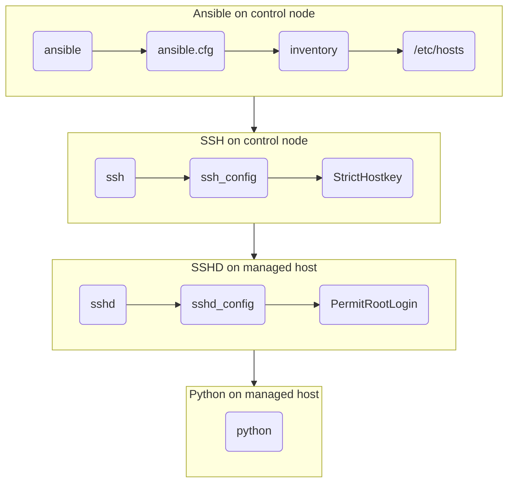

# Exercise 2. Troubleshooting Ansible Configuration

### In this exercise the following steps will be cerried out:

1. Participants are instructed to form group of pairs
2. One member shall introduce some failure to the Ansible configuration
3. Failures can affect any of the boxes on the Figure below
4. The other member shall try to localize and fix the failure introduced
5. The first member observes the process and helps with hints if neccessary
6. They test Ansible successfully access managed hosts together
7. Members of the pair swith roles and do the excercise again

## Figure 1. Validation process for Ansible configuration

## Validation steps for Ansible configuration

| Failure point | Description | Test | Fix |
|---------------|-------------|------|-----|
| **Ansible** | Ansible is installed on Control node | **`ansible --version`** | **`dnf install -y ansible`** |
| **ansible.cfg** | Ansible is installed on Control node | **`ansible --version`** | **`dnf install -y ansible`** |

