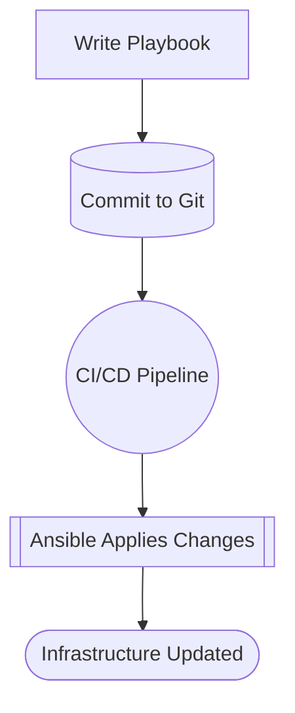

# Why learn Ansible - IaC - GitOps?

### In this section the following subjects will be covered:

1. Why Do We Automate?
2. Introduction to Ansible
3. Infrastructure as Code (IaC)
4. Combining Automation + Ansible + IaC
5. Benefits Summary
6. Next Steps for Learners
7. Visual Workflow
8. Suggested Training Flow
9. Recommended Tools
10. Summary

## Why Do We Automate?

### The Problem with Manual Work

Traditionally, managing infrastructure and applications was done manually:
+ Manually installing packages on servers.
+ Editing configuration files by hand.
+ Deploying updates by copying files via scp or rsync.

### Challenges of manual processes:

|Issue|Why It's a Problem|
|-----|------------------|
|**Human error**|Mistakes happen, especially when steps are complex or repetitive|
|**Inconsistent environments**|"It works on my machine" because no two environments are configured the same way|
|**Slow deployments**|Manual setup can take hours or days|
|**Poor scalability**|Adding more servers increases manual workload linearly|
|**Difficult to audit**|Hard to track who did what and when|

### Benefits of Automation

|Benefit|Description|
|-------|-----------|
|**Consistency**|Every server or environment is configured exactly the same way|
|**Speed**|Automated processes run in minutes instead of hours|
|**Reliability**|Reduces human error by removing repetitive manual steps|
|**Scalability**|Easily scale infrastructure to hundreds or thousands of nodes|
|**Auditability**|Automation scripts provide a clear record of changes|
|**Agility**|Quickly adapt to changes in business needs|

### Real-World Example

Imagine setting up 10 web servers:

+ **Manual way**: SSH into each server, install Nginx, configure it, open firewall rules → takes hours, error-prone.
+ **Automated way**: Run one Ansible playbook → all servers are ready in minutes, identical, and logged.

## Introduction to Ansible

### Ansible is an open-source automation tool that helps you

+ Provision servers
+ Configure infrastructure
+ Deploy applications
+ Manage complex IT workflows

### Key Characteristics

+ **Agentless** → No special software needed on managed nodes, just SSH and Python.
+ **Declarative** → You describe the desired state, and Ansible makes it happen.
+ **Idempotent** → Running the same playbook multiple times won't break things.

### Ansible Core Concepts

|Concept|Description|
|------------|------------------------------------------|
|**Control node**|A host where Ansible (and Python) is running playbooks|
|**Managed hosts**|Servers that Ansible manages, configures, provisions; need no Ansible but Python|
|**Inventory**|A list of servers or devices you manage, written in a simple text file|
|**Module**|A unit of work Ansible can do (e.g., install a package, manage a service)|
|**Playbook**|A YAML file describing tasks to run on hosts|
|**Role**|A structured way to organize playbooks, variables, and files|
|**Task**|A single action (e.g., "Install Nginx")|
|**Idempotence**|Ensures running tasks repeatedly doesn’t cause unintended changes|

### How Ansible Works

1. You write a playbook describing the desired configuration.
2. Ansible connects via SSH to each target machine.
2. Tasks are executed using modules (like package, service, copy).
2. System state is enforced and logged.

### Example: Ansible Playbook

Here’s a simple playbook to install and start Nginx:

#### setup-web.yml
```
---
- name: Install and configure web server
  hosts: webservers
  become: yes

  tasks:
    - name: Install Nginx
      dnf:
        name: nginx
        state: present

    - name: Start and enable Nginx
      systemd:
        name: nginx
        state: started
        enabled: true
```
#### Run it:
`ansible-playbook -i inventory.ini setup-web.yml`

## Infrastructure as Code (IaC)

### What is IaC?

Infrastructure as Code (IaC) is the practice of managing and provisioning infrastructure through code, rather than manually through GUIs or CLI commands.

Examples of things you can manage with IaC:

+ Servers (physical or virtual)
+ Cloud resources (AWS, Azure, GCP)
+ Networks and firewalls
+ Load balancers
+ Databases

### Why IaC Matters

#### Benefits

Version Control	Store infrastructure definitions in Git like application code.
Collaboration	Teams can review changes via pull requests before applying them.
Reproducibility	Build identical environments across dev, test, and production.
Disaster Recovery	Quickly rebuild environments from code if something fails.
Documentation	The code itself becomes the documentation.

### IaC Workflow Example

1. Developer writes a playbook defining a new web server setup.
1. Playbook is committed to GitHub/GitLab.
1. CI/CD pipeline runs the playbook automatically.
1. Infrastructure is deployed consistently across all environments.

### Example IaC Comparison

#### Step	Manual	With IaC (Ansible)

Create server	CLI or cloud console	Code in a playbook
Configure firewall	SSH + firewall-cmd	Automated task
Install web server	SSH + dnf install	Automated task
Document steps	Wiki page	Code is the documentation
Repeat for 10 servers	10x manual work	Run once, scale to 10

## Combining Automation + Ansible + IaC

### When you use Ansible for IaC, you get a powerful, unified approach:

+ Infrastructure is defined as YAML playbooks.
+ Configurations are automated and repeatable.
+ All changes are version-controlled.
+ The process can be integrated with CI/CD pipelines.

### Common Use Cases

#### Use Case	Example

Server provisioning	Deploy 50 cloud VMs on AWS in minutes
Configuration management	Ensure every server has the correct users, packages, and services
Application deployment	Zero-downtime rolling updates of a web application
Security compliance	Enforce password policies, firewall rules, and auditing settings
Disaster recovery	Quickly rebuild production from code

## Benefits Summary

### Category	Benefit

Speed	Deploy in minutes instead of hours or days.
Consistency	Identical environments every time.
Auditability	Track who changed what and when via Git.
Scalability	Manage 10 or 10,000 servers the same way.
Collaboration	Infrastructure changes reviewed like software code.
Resilience	Recover from failures by re-applying playbooks.

## Next Steps for Learners

1. Install Ansible:
   `sudo dnf install ansible -y`
2. Set up an inventory file:
   ```
   [webservers]
   192.168.1.10
   192.168.1.11
   ```
3. Run your first command:
   `ansible all -i inventory.ini -m ping`
4.	Write your first playbook (install Nginx, as shown above).
5.	Use Git to version-control your playbooks.
6.	Explore advanced topics:
    + Roles and collections
    + Dynamic inventory
    + AAP Controller for centralized management
    + Execution Environments for encapsulated ansible dependencies
    + Navigator for a one-shop tool set
    + CI/CD integration

## Visual Workflow



## Suggested Training Flow

### Module	Topic	Hands-On Exercise

1. Why Automate?	Compare manual vs automated server setup
2. Intro to Ansible	Install Ansible, run ping module
3. Ansible Basics	Create a playbook to install Nginx
4. Infrastructure as Code	Store playbooks in Git
5. Real-World Scenario	Deploy a multi-tier app using Ansible
6. Wrap-Up	Review benefits and next steps

## Recommended Tools

+ Ansible → Core automation tool
+ Git → Version control for playbooks
+ Podman/Docker → For local test environments
+ VS Code → Editing YAML files with syntax highlighting

## Summary

Automation with Ansible and IaC transforms the way we manage infrastructure:

+ Manual work → Code-driven processe
+ Slow, error-prone changes → Fast, reliable deployments
+ Hidden tribal knowledge → Transparent, version-controlled playbooks

The result is faster development cycles, scalable infrastructure, and reduced risk.

> [!TIP]
> Key takeaway: Treat infrastructure like code, automate everything possible,\
> and use Ansible to enforce consistency and reliability across your environments.


